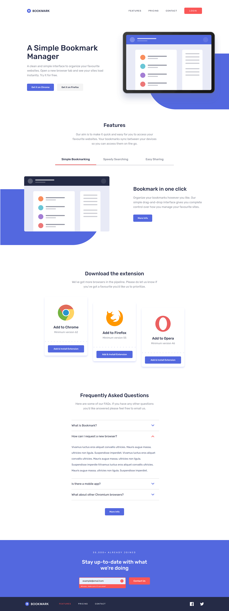
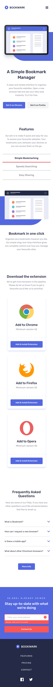

# Frontend Mentor - Bookmark landing page solution

This is a solution to the [Bookmark landing page challenge on Frontend Mentor](https://www.frontendmentor.io/challenges/bookmark-landing-page-5d0b588a9edda32581d29158). Frontend Mentor challenges help you improve your coding skills by building realistic projects. 

Difficulty: Level 3 (Intermediate)

## Overview

### The challenge

Users should be able to:

- View the optimal layout for Desktop (1440px +) and Mobile (375px)
- See hover states for all interactive elements on the page
- Receive an error message when the newsletter form is submitted if:
  - The input field is empty
  - The email address is not formatted correctly

### Links

- Live Site URL: [https://jordansgit.github.io/bookmark-landing-page/](https://jordansgit.github.io/bookmark-landing-page/)

### Built with

- HTML5 
- CSS 
- JavaScript 

### Screenshot

Desktop

Mobile

